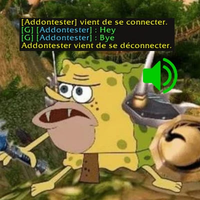

# where-guildmates-wow

### This addon plays a fun sound when a guildmate login or logout.
- When a player from your guild login => you will hear a surprised peon.
- When a player from your guild logout => this time you will hear a relieved peon.
The volume is set by your master volume button in your game.

It was a fun idea from a guildmate so I did it (we have custom sounds for our characters hehe)

Created for World of Warcraft Retail and Classic on Nov 18 (2022)

### Custom audio files
Add audio files ("login_{CharacterName}.ogg" or "logout_{CharacterName}.ogg") in the folder "/WhereGuildmates/sounds/custom" and the addon creates custom rules automatically at load.

### What next for futur versions ?
- For later version (2.1.0+) => an in game interface (maybe) for managing the audio and put it on Master/SFX/Ambiant/Music (to let the user choice)
